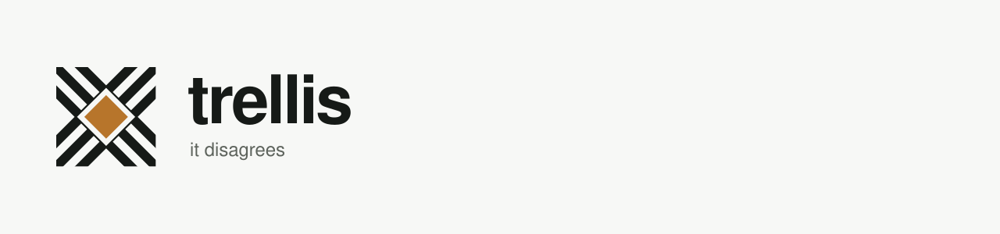

<picture>
  <source media="(prefers-color-scheme: dark)" srcset="assets/readme-banner.svg">
  
</picture>

# It disagrees with you.

First run against a real 41-node graph: 14 problems, 1 error. **Twice it was
right where the person modelling was wrong.**

Of 36 edges, 27 were annotated with how they were known. 7 came out unconfirmed.
Checking all 7 found **2 wrong — and none of the 29 marked verified were.**

**Find out before reality does.**

## What it is

You declare what exists and what each piece requires. trellis derives what is
blocked, what is ready, what a proposed change would unlock, and where the
illegal states are.

The engine is a pure computation — no model calls, no network, no daemon. A full
evaluation of a graph this size is sub-millisecond. One optional command
(`trellis log`) puts a model in front of it to turn a sentence into a proposed
change, and the model only ever proposes: every consequence is still computed.

## What it is not

Not a tracker, a planner, or a scheduler. There are no tickets, no assignees,
no dates, and no estimates, and there is no `owner:` field. If you want to know
who is doing what by when, your tracker already answers that better than this
will. trellis answers the question a tracker cannot: given everything declared,
what is actually true right now.

## Try it

```
python3 --version   # must be 3.11 or newer
pip install git+https://github.com/looseleafgallery/trellis.git
```

**Check the version first.** The `pip` bundled with macOS system Python 3.9 is
old enough to ignore `requires-python`, so the install half-succeeds and the
first error you see names a missing PyYAML rather than the version. trellis
raises a clear message on import if it is running on anything older than 3.11,
but an old pip can get you there in the first place.

Or `pipx install git+https://github.com/looseleafgallery/trellis.git` for a
global `trellis` command. There is no `pip install trellis`: that name belongs
to an unrelated project on PyPI — an alpha last touched in 2008. When this is
published it will be as **`trellis-kernel`**. The command, the import, and the
tool are all `trellis` regardless; only the distribution name differs.

No server, no account, nothing to configure. Then try it against the shipped
example:

```
git clone https://github.com/looseleafgallery/trellis.git
cd trellis/examples/agent-loop
trellis state
trellis explain agent.emit
trellis doctor
```

## The model

Two kinds of node.

**Work** is anything you can finish: an initiative, a project, a stage, a
one-line change. Nesting is by `parent`, and progress rolls up from the leaves.

```yaml
id: agent.tool_exec
title: Tool execution stage
parent: agent
status: not_started
# not_started | in_progress | done_unverified | done | superseded | abandoned
gates:
  start: agent.plan.done and contract.tool_schema.live
  finish: has(tools.streaming, "streaming-results")
provides: [tool-results]
```

**Contracts** are the agreements between subsystems — a schema, a handoff
envelope, a gate two pipelines have to see the same way.

```yaml
id: contract.tool_schema
kind: contract
status: agreed               # draft | proposed | agreed | frozen
version: 2
satisfied_by: [tools.registry, tools.sandbox]
```

Making the agreement its own node is the point. If a gate between subsystems is
an edge, then N subsystems agreeing on it is N² edges and no single place to
look. As a node, producers `satisfy` it, consumers `require` it, the agreement
is one artifact you can diff, and bumping its version invalidates exactly its
consumers.

A contract is `live` only when it is agreed *and* everything implementing it is
done. Not-live splits into `unagreed` (waiting on people to decide) and
`pending` (waiting on work to land) — a stuck pipeline needs a different push
depending on which one it is.

Two work statuses are easy to miss. `done_unverified` is
complete-but-unchecked: it stops a green-but-unreviewed change being called
done, and exports `complete: true` with `done: false` so strict gates stay shut
while permissive ones can proceed at risk. `superseded` is
replaced-by-something-else rather than dropped, which changes whether you delete
the node or keep it as a pointer.

### Which item is this

Every node in a real graph usually corresponds to something in a tracker.
`ref:` is where that goes — one optional, opaque string:

```yaml
id: safety.d1
title: External-gate contract v1
ref: ENG-1552
status: in_progress
```

trellis never fetches it, parses it, or assumes there is one tracker. It exists
so a second document can *join* on the graph rather than restate it. Without a
key to join on, the ticket id ends up inside the title, and a reworded title
silently breaks every lookup — titles being the field most likely to be
reworded.

Once a node has one, the ref works anywhere a node id does:

```
trellis state ENG-1552
```

Node ids always win, and a ref naming two nodes resolves to neither — it says
which two, because picking one would be inventing an answer the graph does not
have. `trellis state --ref` shows the column, `--json` carries it on every node
record, and snapshots keep it so a frozen record stays joinable.

A ref that cannot resolve is reported rather than left to be discovered:
`duplicate_ref` when two nodes claim the same item (only the join is ambiguous,
so this is info, not a refusal), and `shadowed_ref` when the ref is also a node
id, so a lookup returns that node instead and this ref can never resolve.

One node, one ref. A list is refused at load rather than coerced. Two YAML
papercuts are refused by name rather than silently accepted: quote a ref
starting with `#` or it reads as a comment (`ref: "#39"`), and quote `yes`,
`no`, `on` or `off` or they read as booleans. A bare number is fine — `ref:
1552` is a ticket id, and looking it up by `1552` works.

**This is identity, not grounding.** It says *which thing this is*, never *is
this claim still true* — no status is ever set from it.

## Gates

Gates are boolean expressions over other nodes' exports, in a whitelisted
subset of Python syntax:

```
agent.plan.done and contract.tool_schema.live and contract.tool_schema.version >= 2
```

Available on any node: `done`, `complete`, `active`, `abandoned`, `superseded`,
`dead`, `provides`, `children_done`, `progress`, `leaf_done`, `leaf_total`,
plus whatever that node publishes. Contracts add `live`, `agreed`, `frozen`,
`version`. Helpers: `has(node, "tag")`, `all_done(...)`, `any_done(...)`,
`count_done(...)`, `at_least(n, ...)`.

**The references in an expression are the dependency edges.** There is no
`depends_on:` list, because a hand-maintained one drifts away from the
requirement that actually matters.

`start` and `finish` are separate gates, and a node can be startable long
before it is finishable. Gate names are otherwise open: any other name you use
is evaluated and reported too — useful for tracking a `review_passed` or
`security_signoff` condition without letting it gate readiness.

Declaring something `done` behind an unsatisfied gate is not silently
accepted — it is reported as a violation, which is usually how you find out two
subsystems disagreed about what "done" meant.

A work node can also be waiting on a *person* rather than on work:

```yaml
id: a.thing
status: not_started
awaiting: which of the two storage backends we standardise on
```

Its readiness becomes `awaiting`, and `trellis ready` excludes it — the gate is
open, but nobody can pick it up until someone decides. Blocked-by-work still
outranks it: if the gate is shut, the work is the truth. The text says *what* is
owed, never *who* owes it.

## Commands

|                                           |                                                                       |
| ----------------------------------------- | --------------------------------------------------------------------- |
| `trellis check`                           | validate the graph; list every violation                              |
| `trellis state [node]`                    | derived state, as a tree or for one node (`--ref` shows external ids) |
| `trellis ready`                           | work whose start gate is satisfied right now                          |
| `trellis explain <node>`                  | why it is blocked, down to root causes                                |
| `trellis impact <node> --set status=done` | what-if: diff the whole system                                        |
| `trellis blocking <node>`                 | what it is holding up, and what waits behind it                       |
| `trellis deps <node> [-r]`                | dependencies, or dependents                                           |
| `trellis graph --around <node>`           | draw a slice, in the terminal or as mermaid                           |
| `trellis set <node> status=done`          | change declared state, with a preview first                           |
| `trellis log "<what happened>"`           | describe it in prose; a model proposes the delta                      |
| `trellis history`                         | what has been applied, and why                                        |
| `trellis drift`                           | what was changed around the tool since it last wrote                  |
| `trellis trust`                           | challenge the declaration: what is stale, what churns                 |
| `trellis reconcile`                       | walk the unconfirmed edges; record what held                          |
| `trellis doctor`                          | everything that looks wrong, with what to do about it                 |
| `trellis review`                          | the same findings, one at a time, with a person deciding              |
| `trellis snapshot`                        | freeze what the graph means now                                       |
| `trellis stats`                           | cache and recomputation counters                                      |

Add `--json` to any of them. Anywhere a command takes `<node>`, a `ref:` that
names exactly one node works too.

`impact` is the one that answers "I moved one piece, what happens":

```
$ trellis impact tools.sandbox --set status=done
what if -> tools.sandbox: status=done

unlocks:
  > tools.streaming  Streaming tool results
contracts that go live:
  + contract.tool_schema

cost: recomputed 5/13 nodes (8 reused from cache)
```

Change several things at once by prefixing a node id: `--set status=done --set
'agent.plan@status=done'`.

## The write loop

Reading the graph is only half of it. `set` and `log` close the loop, and both
run the same four steps:

```
propose  ->  validate  ->  preview  ->  confirm  ->  write
```

`set` is the deterministic entry point:

```
$ trellis set tools.sandbox status=done
proposed:
  ~ tools.sandbox  status: in_progress -> done

unlocks:
  > tools.streaming  Streaming tool results
contracts that go live:
  + contract.tool_schema

cost: recomputed 5/13 nodes (8 reused from cache)

apply? [y/N]
```

`log` is the same loop with a model on the front, mapping a sentence onto node
ids and status values:

```
trellis log "finished the sandbox work and we signed off on the tool schema"
```

**The model only proposes.** It maps prose onto ids and statuses, and stops. It
never decides what a change unblocks, whether a gate is satisfied, or what
state the system lands in — the engine computes all of that, exactly as it does
for a change you type by hand. A proposer that is only asked to do the part
requiring language cannot be wrong about the part requiring logic. Anything it
cannot confidently map comes back as `unmatched` rather than a guess, and every
proposal is shown with its confidence before you accept it.

**The preview is not a separate rendering of what is about to happen** — it is
`queries.impact` over the very overlay that gets written, so it cannot drift
from the result.

`log` requires the optional extra and credentials: `pip install -e '.[llm]'`
plus `ANTHROPIC_API_KEY`. The core engine never imports it.

### How writes land

Your YAML is written and read by people: comments, `notes: >` blocks, a
deliberate ordering. A parse-and-dump round trip would quietly reformat all of
that, so `trellis` edits the specific line and leaves every other byte alone —
a status change is a one-line diff.

Line surgery is only safe with a check behind it. After every write the graph
is reloaded and verified: the intended change landed, and no other node's
fingerprint moved. If either check fails, the original bytes are restored and
the write is reported as failed. Only scalar fields (`status`, `version`,
`title`, `parent`) are writable; rewriting a `gates:` block is a structural edit
and belongs in your editor. New nodes are written to their own file rather than
appended into an existing one.

Every applied change is appended to `history/journal.jsonl` with the sentence
that produced it. The YAML holds current state and git holds the diffs; neither
holds the *why*.

### Starting somewhere you did not build

An agent working in your repository has `trellis` installed and no copy of
this one. `trellis brief` prints the operating manual — the same `AGENTS.md`
that ships with the package — with three lines about the graph in front of it
first:

```
$ trellis brief
# This graph, right now

- 21 nodes at /path/to/graph
- 0 findings, 0 error(s), 7 acknowledged
- ready to pick up: core.concurrency, dist.release_process, ...
```

It still prints the manual when the graph will not load, because that is when
someone most needs it. `--manual-only` skips the summary.

### Propose now, decide later

Something models and someone decides, and they are almost never at the keyboard
at the same time. Without somewhere to put it, "this was proposed and nobody
has ruled on it" ends up in prose in another system — a second place to be
wrong. So a write can be queued instead:

```
trellis set a status=done --propose --because "tests green, awaiting review"
trellis pending
trellis accept p3
trellis reject p4 --because "that was a different branch"
```

Queuing happens **after** the preview, not instead of it. Whoever proposes
still sees what it would do; it is the person deciding who is elsewhere.

**Accepting recomputes, it does not replay.** A proposal made on Tuesday may
unlock something different by Friday, or create a violation it did not before.
Showing you the preview captured at propose time would be the CI badge that was
true when it ran, so the consequence is computed against the graph as it is
when you accept.

That leaves two different ways a queued proposal can go bad, and they get
different answers:

- **the node moved** — what you proposed against is not what is there now.
  Refused, naming the node. This is an identity question and the fingerprint
  answers it exactly; because the fingerprint is semantic, rewording a `notes:`
  block does not cost you a pending decision.
- **the consequence changed** — it still applies cleanly, it just does
  something else now. Re-previewed, not refused. A graph that moves around a
  live proposal is normal, and refusing there would make the queue unusable.

**Rejections are kept, with their reason.** Propose the same change again and
it says when it was turned down and why — told, not refused, because the same
change can be right later. That is what stops a rejected proposal arriving
every month with nobody able to remember what was wrong with it.

Proposals live in `history/proposals.jsonl`, committed, append-only: an accept
or reject is a later record, never an edit to the proposal. `trust` challenges
anything sitting undecided for three weeks, because a queue nobody empties is a
worse place for a decision than the prose it replaced — it looks handled.


### trellis owns the state machine

Everything trellis knows about *why* a graph looks the way it does comes from
changes passing through the loop; a hand edit gets no preview, no verification,
no journal entry, and — when it walks a status backwards — no recorded reason.

Hand editing is still allowed. The drift is yours:

```
$ trellis drift
1 node(s) changed outside trellis:

  ! tools.sandbox: trellis wrote 'done', file says 'in_progress'
      last written 2026-08-21T18:52:53+00:00

1 of these walked a status backwards. Those are corrections,
and the reason for each was never recorded.
```

Only nodes trellis has actually written are compared — a node that has never
been through `set` is not drifting, it simply is not managed by the tool.
Reconcile either by changing it back through the loop, or by accepting the edit
and recording what the file now says:

```
trellis drift --accept --because "reverted by hand while debugging"
```

Accepting is a separate act rather than "just run `set` again", because the
file already says what you would be setting it to. Drift tracks status only;
structural edits are always by hand.

### Corrections are not revisions

A status moving backwards — `done` to `in_progress`, `agreed` to `draft` — is a
belief being revised rather than progress being undone. Forward is progress;
`abandoned` and `superseded` are decisions; only walking back is an error being
admitted.

So `set` says so and asks why before applying it. The reason is the only part of
a correction that is not recoverable afterwards, and the moment it happens is
the only time the answer is cheap. `--because "..."` supplies it
non-interactively.

`trust` then reports corrections separately from revisions, because they look
identical in a diff and mean opposite things: a contract revised nine times is
being negotiated, while a node corrected twice was wrong twice, and what it
claims now is worth less.

## Trust

Evaluation is the easy half. The half that decides whether anyone still uses
this in week three is whether the declaration is honest — because a graph
nobody trusts is worse than no graph, being confidently wrong rather than
obviously absent.

`trellis trust` challenges the declaration using two signals that cost nothing
and integrate with nothing:

```
$ trellis trust
stale - claims to be moving but has not changed in 14+ days:
  ! agent.plan          in_progress   unchanged 21d (via git)

churning - revised well above this graph's median:
  ~ contract.tool_schema   9 revisions

these are challenges, not corrections - nothing here changed any state
```

**Volatility** is revision count of the declaring file, from `git log`. A
contract at 9 revisions against a median of 2 is not the same contract as one
written once and left alone, even though both currently read `agreed`. `impact`
annotates what it unlocks with it:

```
contracts that go live:
  + churny.contract   [declaration revised 9x - check it is current]
```

**Age** is how long a declaration has sat unchanged, taken from the journal
where it knows the specific node and from git otherwise. Only declarations that
*claim motion* are challenged: `in_progress` untouched for three weeks is a lie,
`not_started` untouched for three weeks is accurate.

**Everything here challenges, never sets.** Nothing changes a status or opens a
gate. Where the graph is not in git, every signal degrades to "unknown" rather
than to a wrong answer.

Two deliberate limits. Volatility is per *file*, so a file holding several nodes
reports a shared count and says so. And volatility is not classified at all
below four nodes with history: an outlier needs a baseline to be an outlier
against.

### Edge provenance

An edge checked against a system of record and one read out of a prose sentence
render identically without help, so a reader trusts them uniformly and should
not. Annotate them:

```yaml
id: agent.emit
gates:
  start: agent.reflect.done and contract.stage_handoff.live
evidence:
  agent.reflect: {how: verified, at: 2026-08-20}
  contract.stage_handoff: inferred        # shorthand for {how: inferred}
```

`how` is a closed set, most trustworthy first: `verified` (checked against a
system of record), `stated` (someone said so), `inferred` (read out of prose,
never confirmed), `assumed` (nobody said it). Closed on purpose — an open
vocabulary could not be reported consistently.

**The annotations turn out to be calibrated.** On the first real graph — 41
nodes, 36 edges — 27 edges were annotated and 7 came out unconfirmed. Checking
all 7 against the tracker found 2 wrong. None of the 27 marked `verified` were.
One of the two was a name collision: two projects each had a decision called
`D3`, and the wrong one got referenced. That is precisely the class of error
nobody catches by rereading their own graph, and the annotation had already
pointed at it.

`explain` then distinguishes them, which turns a blocked node into an
instruction:

```
- agent.reflect.done  ->  agent.reflect is blocked   [edge verified 2026-08-20]
- contract.stage_handoff.live  ->  ... [edge inferred, never confirmed - check this]
```

and `trust` reports two provenance failures: **unconfirmed edges**, believed on
inference or assumption and never checked, and **stale verifications** — `at` is
a shelf life, not a stamp. An edge was true against the thing it was checked
against, at that moment; that thing can move afterwards without anything here
noticing. This is the green-but-wrong CI check, expressed in the model.

`trellis reconcile` walks the unconfirmed ones and records what you found:

```
$ trellis reconcile
7 edge(s) to check against the world.
checked 12 before; 2 turned out wrong.

[1/7] agent.emit -> contract.stage_handoff
  (inferred, never confirmed)

  [h] held  [w] wrong  [s] skip  [q] quit
> w
  why? the D3 in that sentence was the other project's
```

The outcome is **not recoverable afterwards**: a confirmed edge becomes
`verified` in the YAML, a wrong one gets rewritten or deleted, and the wrong
case usually deletes the evidence of its own failure. So it is recorded in the
journal, where it survives the edge. `trust` then reports what the annotations
turned out to be worth, split by the two questions you can act on — which
*kind* of annotation was wrong, and *whose*:

```
edge provenance: 27/36 edges annotated
  checked so far: 2 of 7 were wrong
    inferred               2 of 3 wrong
    verified               0 of 2 wrong
    stated                 0 of 1 wrong
  by source:
    code-scanner           2 of 3 wrong
    linear                 0 of 2 wrong
  last checked 2026-08-14 (8d ago)
```

**Counts, never a rate.** Two of seven is honest; 29% invites being read as a
property of the world rather than of one graph on one day. That holds in the
JSON too, where a consumer could divide the numbers itself — handing over a
rate would be the tool drawing the one conclusion the rest of its output
refuses to draw.

The counts are **all time, not a recent window.** Windowing would shrink a
denominator that is already small, which is the failure the counts-never-rates
rule exists to prevent. So the age of the evidence is stated rather than used
to discard it: a pass from a year ago and one from yesterday produce identical
counts, and `last checked` is what tells them apart.

This is also the number that makes an extractor safe to install. Something that
proposes edges from code earns its place by being scored, not by being
plausible, and `by source` is the score.

### Why trust is a separate layer

Age depends on the wall clock, and the engine's cache key is a hash of its
inputs. Letting "today" into that hash would mean entries silently expiring at
midnight, or a cache hit returning yesterday's answer. So the engine stays
time-free and exactly cacheable, and everything time-dependent lives outside it
and is recomputed per query — one `git log` call.

`check` stays time-free too: it answers *is this declaration well-formed*.
`trust` answers *should you believe it*.

## Findings, and answering them

`doctor` is `check` plus `trust` plus a remedy for each finding — a code says
what is true, a remedy says what to ask:

```
$ trellis doctor
2 thing(s) look wrong to me:

  . contract.stage_handoff: still proposed but 1 node(s) gate on it (agent.emit)
      -> nobody has agreed this. Ask both sides whether it is settled.
  . agent.emit: its edge to contract.stage_handoff is inferred and was never confirmed

none of this changed any state. these are questions, not corrections.
```

On a graph too small to have anything wrong with it, it says that rather than
congratulating you. Findings are ranked by what to fix first, not just by
severity, and `check` ends by naming one:

```
start with: sys.b - dangling_reference
  -> names a node that does not exist. Typo, or not modelled yet?
```

`trellis review` is the same list as a session, doing what it can do safely and
routing everything else to you:

```
[1/7] warn  contract.x
  still draft but 1 node(s) gate on it (consumer); nobody has agreed it
  -> nobody has agreed this. Ask both sides whether it is settled.

  [a] acknowledge  [x] explain  [e] edit  [s] skip  [q] quit
```

`a` writes the acknowledgement and asks why, journaling both. `f` appears only
where the remedy is an unambiguous status change, and goes through the normal
preview and confirmation rather than around it. `e` opens `$EDITOR` at the
node's line. `x` runs `explain` without consuming the finding. After any change
the graph is re-read and the remaining findings recomputed. Errors do not offer
`a` at all — a defect is not an opinion. Interactive only; non-interactively it
points you at `doctor`.

Some findings are true and will stay true — two spike-only projects that
genuinely have no relationships will be reported as `inert_node` on every run,
and a signal that fires forever is how a whole severity gets tuned out:

```yaml
id: spike
status: in_progress
acknowledge: [inert_node]
```

`check` reports each acknowledgement with the reason it was made, and says `no
reason recorded` where there is none — without it the entry says only that
somebody once decided something. `review` asks for the reason and journals it.
Where the graph is written by something that cannot be asked a question — a
script, an agent, an export — declare the reason beside the code instead:

```yaml
id: spike
status: in_progress
acknowledge:
  - code: inert_node
    why: spike only, one ticket, nothing gates on it yet
```

Both forms mean the same thing, can be mixed in one list, and silence the same
finding; the second one also records why. Where a node and the journal both
have a reason the node's is shown, because it is the current statement and is
editable in place. Declaring it also means the reason survives a lost journal,
which the acknowledgement itself already did.

Acknowledged findings are **counted, not hidden** — `check` reports `2
acknowledged and not shown`, because an acknowledgement you cannot see is
indistinguishable from a bug. If an acknowledged finding stops firing, that is
reported too. **Errors cannot be acknowledged.** A dangling reference or a cycle
is a defect, not an opinion, and a graph that cannot evaluate must not be able
to look clean. Acknowledging an error code is itself reported.

### Corroborators

A corroborator checks the declaration against a system trellis does not own:

```
# trellis.toml
[corroborator.linear]
command = ["trellis-linear-check"]
```

Snapshot JSON on stdin, findings on stdout, merged into `doctor`. It joins on
`ref:` — which is what that field was for. Three constraints, each earned rather
than chosen:

**A corroborator may report `info` or `warn`, never `error`.** An error means the
graph cannot be evaluated, and only the kernel can establish that. A
disagreement with a tracker is a question, however confident. This also keeps
ranking honest — external findings slot into known bands instead of competing
with facts the kernel established itself.

**Codes are namespaced** — `linear:state_disagrees`. You can see where a finding
came from, and nothing external can impersonate a kernel diagnostic.

**Failing is a finding, never a silence.** A corroborator that could not run has
not told you the graph is fine:

```
? (graph): could not be checked against linear: 'trellis-linear-check' not
  found. This is silence, not agreement - whatever it would have found is
  unknown.
```

Corroborators and renderers are two of the three interfaces trellis exposes
without owning what is on the other side; see
[`docs/BOUNDARY.md`](docs/BOUNDARY.md) for where the line sits and why.

## Slices

Two commands exist because a person cannot answer their question from memory
and will otherwise answer it wrongly. That is the bar any new output has to
clear here.

```
$ trellis blocking tools.sandbox
unlocks 1 node(s) the moment it lands:
  > tools.streaming  Streaming tool results

4 more blocked downstream, also waiting on other things:
  . agent.emit  Emit final response
  ...
```

**Two numbers, because they answer two questions.** `unlocks` is what starts
moving the moment this lands. `waiting` is everything downstream that cannot
start while it is open — larger, because most of it is waiting on other things
too. Quoting the second as the first is the usual way this gets said wrong, and
it is a mistake with a real instance behind it: someone told their team a node
"unblocks six slots" all week when the answer to the question they meant was
five. `unlocks` is computed through the same what-if path `impact` uses, so the
two cannot drift apart.

`trellis blocking --all` ranks every open node by what it is holding up —
chokepoints, without having to guess where to look.

And a picture:

```
trellis graph --around agent.plan --hops 2
trellis graph --contracts          # contracts and whoever touches them
trellis graph --blocked            # only what is not moving
```

Draws in the terminal by default:

```
x agent.reflect               blocked  Reflection stage
`- x agent.tool_exec          blocked  Tool execution stage
   |- ~ agent.plan            active   Planner stage
   |- ~ contract.tool_schema  pending  Tool call schema
   `- ~ tools                 active   Tooling subsystem
```

Top-down from what is waiting to what it waits on. It is a *tree* projection of
a graph, so a node needed by two things appears twice — the second marked
`(above)` rather than redrawn. A general graph layout in fixed-width characters
becomes unreadable at exactly the size where you need it, and an honest repeat
costs one line.

```
trellis graph --contracts -f mermaid   # source, to paste into an issue or PR
trellis graph --contracts -f html      # a page you can open
```

`mermaid` is what you want for someone who does not have trellis — GitHub
renders it inline, and arrows are drawn prerequisite → dependent so the diagram
reads the way the work flows. `html` writes a self-contained page; **the graph
is written into the file**, so nothing about your project leaves the machine.
Only mermaid itself is fetched, and only when you open the page.

The size limits are about readability, not speed — rendering 800 nodes takes
about a millisecond. A tree stays scannable to about 120 nodes; a diagram stops
being a picture nearer 40, and refuses past 25 without `--force`. Depth is
capped at twelve levels, past which the branch is cut and says how much it cut.

## Snapshots

Git has your YAML. What it does not have — and what you cannot recover by
checking out an old commit — is what the graph *meant* at a moment. Derived
state depends on the engine, and the trust layer reads today's git history:
volatility, staleness and drift are all computed against now. Run `check`
against a three-week-old checkout and you get today's answers about
three-week-old files, which is nobody's question.

```
trellis snapshot -m "before the schema landed"
trellis snapshot --render mermaid --render brief
trellis snapshot --list
```

**It is called a snapshot because that is a promise.** It is frozen on purpose,
it is stale the moment after it is taken, and freshness is the reader's problem.
So: nothing ever refreshes one in place, nothing presents one as current, and
age leads every listing. `state` and `doctor` answer for now; this answers for
then.

Snapshots are content-addressed by the derived state they capture. Taking one
twice from an unchanged graph is recognised rather than duplicated. They live in
`snapshots/`, are meant to be committed, and are indexed in
`snapshots/index.jsonl`.

A renderer is anything that reads JSON on stdin and writes an artifact on
stdout:

```
# trellis.toml
[renderer.brief]
command = ["your-tool", "--audience", "novice"]
extension = "md"
```

A renderer is **never handed a path to your graph** — only the snapshot, on
stdin. Read-only is a property of the interface rather than a rule anyone has to
follow, which is why an external renderer is safe to point at code you did not
write. `json` and `mermaid` are built in; `trellis snapshot --renderers` lists
what is available.

## Where things live

```
proj/
  graph/          the declaration
  history/        the journal - committed
  snapshots/      point-in-time captures - committed
  .trellis/       the evaluation cache - gitignored
```

The journal is the only copy of *why*. None of it is recoverable from the YAML
or from git, so it is committed. The cache is derived and recomputable, so it is
not. A journal in the old location is still read, so moving it is something you
do when you get to it — `check` gives you the command. A graph with **no**
journal is said out loud rather than quietly answering a weaker question:

```
no journal for this graph, so answers here are weaker than they look:
  - age is per file, not per node
  - corrections and their reasons are unknown
  - drift has no baseline to compare against
```

## Starting a graph

There is no `trellis init` wizard. The hard part of starting a graph is the
interview, and a scripted question flow cannot follow up, cannot probe a vague
answer, and starts cold — while an agent already working in your repo has read
the design docs and been in the conversation. So the procedure lives in
[`AGENTS.md`](AGENTS.md), written for an agent to execute with you: what to ask,
in what order, how much to write down, and how to annotate what it believed and
why.

Its central rule, measured rather than asserted: **take nodes from anywhere,
take edges from a system of record, and interview only for the edges no system
of record has.** On the first real bootstrap, 2 of 7 edges read out of prose
were wrong; every edge taken from the tracker was right.

One property of that procedure belongs here rather than there, because it is
what makes the output worth reading: **the agent transcribes the tool's
objections rather than generating them.** The last step of a bootstrap is
`trellis doctor`, so the disagreement is mechanical rather than a matter of an
agent's judgment.

Every YAML example in `AGENTS.md` and this README is parsed by the test suite,
so a doc that drifts from the schema fails CI rather than teaching an agent to
write files that do not load.

## trellis uses trellis

`graph/` at the root of this repository is trellis's own roadmap, modelled with
the procedure in `AGENTS.md` and held to its own rules — contracts first, stop
at about eight nodes, annotate provenance honestly.

```
trellis doctor      # from the repo root
trellis blocking --all
```

It disagrees with its author, which is the test `AGENTS.md` sets for a
bootstrap. Two nodes are flagged `inert_node` and are genuinely independent
work; whether to acknowledge that is a call for whoever owns them, not for
whoever wrote the file.

## What it does not do

No model-judged gates. A requirement like "the retriever is fast enough" cannot
be expressed as an expression today. The engine is shaped for it — a
model-backed gate is just another evaluator behind the same cache key — but it
does not exist yet.

No bootstrapping from an existing repository. You write the graph by hand or
grow it through `log`; nothing reads your code, issues, or PRs to propose one.

**Partial structural critique.** `check` flags reaching inside a subsystem,
contracts nobody drafted or implements, work belonging to no parent, and inert
nodes that require nothing and are required by nothing. The wider pass — nodes
that always move together in the journal, heavy fan-in that wants to be an
explicit interface — is not built.

No structural writes. Gates, `provides`, and `satisfied_by` are edited in your
editor, not through the CLI.

## Design notes

Two things worth knowing if you are deciding whether to depend on this.

**Published facts.** A subsystem declares the facts it offers the rest of the
graph, and everything else gates on those rather than on what is inside:

```yaml
id: tools
publishes:
  streaming_results: has(tools.streaming, "streaming-results")
```

Without this, any node anywhere can gate on `tools.streaming.done` — and the
moment it does, the tools subsystem can no longer be split, renamed, or
reordered without silently breaking a gate in a subsystem that never knew it
existed. Components can only "change freely" if their internals are not
addressable from outside. Published facts are the **external** interface: gate
on them from other subsystems, and inside a subsystem let a sibling reference
its sibling directly. `check` reports a gate that reaches inside a subsystem it
is not part of as `reaches_inside` — advice, not an error, since it is sometimes
what you mean. A caveat: a parent still exports `progress` and `leaf_done`, so
published facts decouple *structure*; they do not silence rollup churn.

**Why it stays cheap.** Every node's derived state is a pure function of its own
declared fields plus the **exports** of its dependencies — nothing else. The
cache key is a hash of exactly those inputs, so a hit is exact by construction
and there is no invalidation pass to get wrong. Exports are deliberately coarser
than derived state: when a stage goes `blocked -> ready`, its exports do not
change, its dependents' keys do not change, and the walk stops dead. This *early
cutoff* is where the efficiency comes from. The cache is persisted to
`.trellis/cache.json`, so reuse spans invocations. For a few hundred nodes none
of this is load-bearing yet — it is built now because the cache key is the part
that has to be right *before* an expensive evaluator exists.

## Layout

```
trellis/model.py        declared nodes, graph, edge extraction
trellis/loader.py       one YAML file per node, read off disk
trellis/expr.py         gate expression parsing, evaluation, traces
trellis/engine.py       incremental evaluator, exports, violations
trellis/cache.py        content-keyed memo store
trellis/queries.py      check, ready, explain, impact
trellis/delta.py        a proposed change, and its validation
trellis/edit.py         YAML line surgery, with verify-or-restore
trellis/journal.py      append-only record of what was applied
trellis/snapshot.py     content-addressed point-in-time captures
trellis/corroborate.py  external checks, merged into doctor
trellis/viz.py          terminal, mermaid and html drawings
trellis/evidence.py     volatility, staleness, provenance: challenge, never set
trellis/propose.py      prose -> proposed delta (the only model call)
trellis/cli.py          command line
AGENTS.md               how an agent should bootstrap and maintain a graph
examples/agent-loop     a pipeline with cross-subsystem contracts
```

Contributors: see [CONTRIBUTING.md](CONTRIBUTING.md). Working with an agent:
[AGENTS.md](AGENTS.md).
